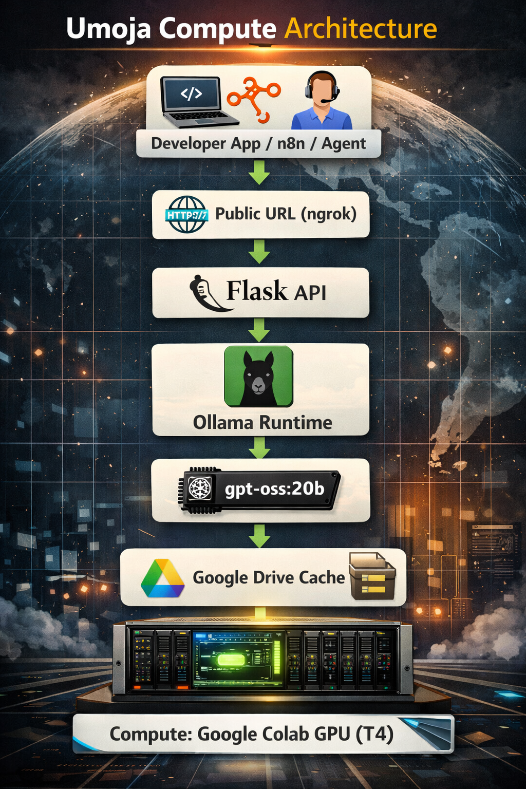

# Umoja Compute

## Architecture



**Free OpenAI-Compatible Infrastructure for Running Open Models
Anywhere**

Umoja Compute is an open AI infrastructure platform that lets you run
large language models on distributed compute and expose
**OpenAI-compatible APIs** --- without paying for expensive cloud
inference.

Run powerful open models, connect them to your apps, and monitor usage
--- all using free or low-cost compute.

------------------------------------------------------------------------

## Why Umoja Compute?

AI innovation is limited by infrastructure costs.

Umoja Compute removes that barrier by providing:

-   OpenAI SDK compatibility (`/v1/completions`, `/v1/chat/completions`)
-   Free GPU compute via Google Colab (T4)
-   Persistent model caching in Google Drive
-   Public API endpoints via secure tunneling
-   Built-in observability (requests, latency, usage)
-   Workflow-ready integration (n8n, Docker, agents)

**Drop-in replacement for OpenAI. Zero infrastructure cost.**

------------------------------------------------------------------------

## OpenAI SDK Compatible

Use your existing OpenAI code:

``` python
from openai import OpenAI

client = OpenAI(
    base_url="https://your-umoja-endpoint",
    api_key="none"
)

response = client.chat.completions.create(
    model="gpt-oss:20b",
    messages=[{"role": "user", "content": "Explain Umoja Compute in one sentence."}]
)

print(response.choices[0].message.content)
```

No changes required. Just swap the base URL.

------------------------------------------------------------------------

## Architecture

Client App\
→ Public URL\
→ Flask API\
→ Ollama Runtime\
→ Open Model (gpt-oss:20b)\
→ Response

Compute runs on: - Google Colab GPU (T4) - Model cached in Google Drive
(no re-download)

------------------------------------------------------------------------

## Quick Start

1.  Open the notebook\
    `Umoja_Compute_Genesis_v1.ipynb`

2.  Get your auth token from:\
    https://ngrok.com/

3.  In Colab:

    -   Runtime → Change runtime type → GPU (T4)
    -   Run all cells

4.  Copy your public API URL

Test:

``` bash
curl -X POST "$PUBLIC_URL/v1/completions" -H "Content-Type: application/json" -d '{
  "model": "gpt-oss:20b",
  "prompt": "Why is open infrastructure important?",
  "max_tokens": 100
}'
```

------------------------------------------------------------------------

## Use Cases

-   AI startups prototyping products
-   Hackathons and research
-   AI agents and automation systems
-   Local AI backends for tools like:
    -   n8n
    -   POS systems
    -   Analytics platforms
    -   Internal enterprise tools

------------------------------------------------------------------------

## Observability

Umoja Compute includes:

-   Request logging\
-   Token usage tracking\
-   Latency monitoring\
-   Model usage visibility

Designed for production experimentation and enterprise evaluation.

------------------------------------------------------------------------

## Roadmap

-   Streaming responses
-   Authentication & API keys
-   Multi-user support
-   Auto session recovery
-   Docker local deployment
-   Kubernetes scaling
-   Web observability dashboard
-   Multi-model routing

------------------------------------------------------------------------

## Vision

Umoja Compute is building the **open infrastructure layer for AI** ---
enabling developers and organizations to run, scale, and control their
own intelligence without dependency on closed platforms.

------------------------------------------------------------------------

## License

MIT License

------------------------------------------------------------------------

## Contributing

Contributions are welcome.\
If you want to help build open AI infrastructure, open an issue or
submit a pull request.
